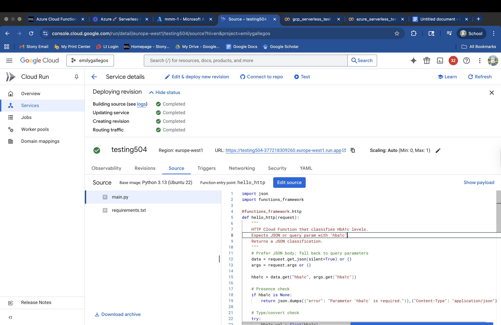
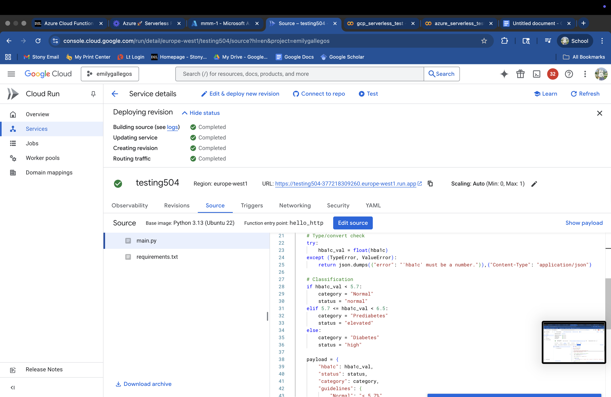
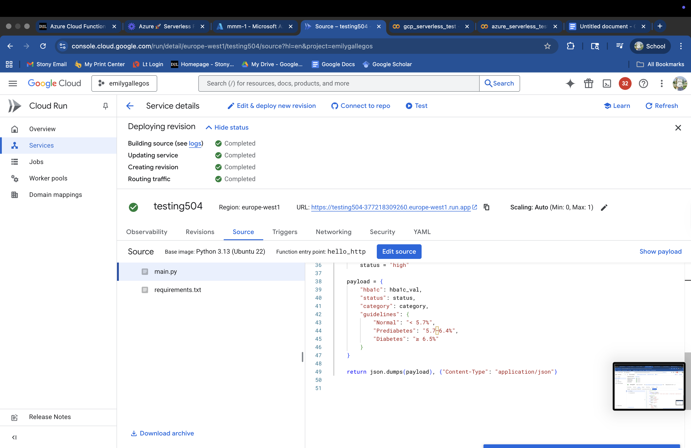
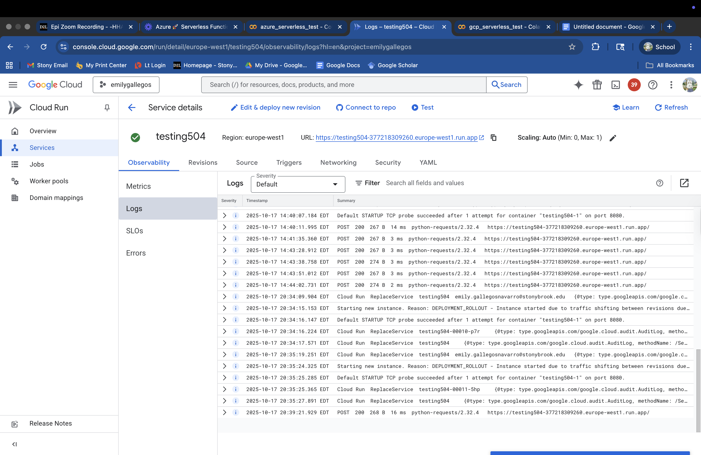
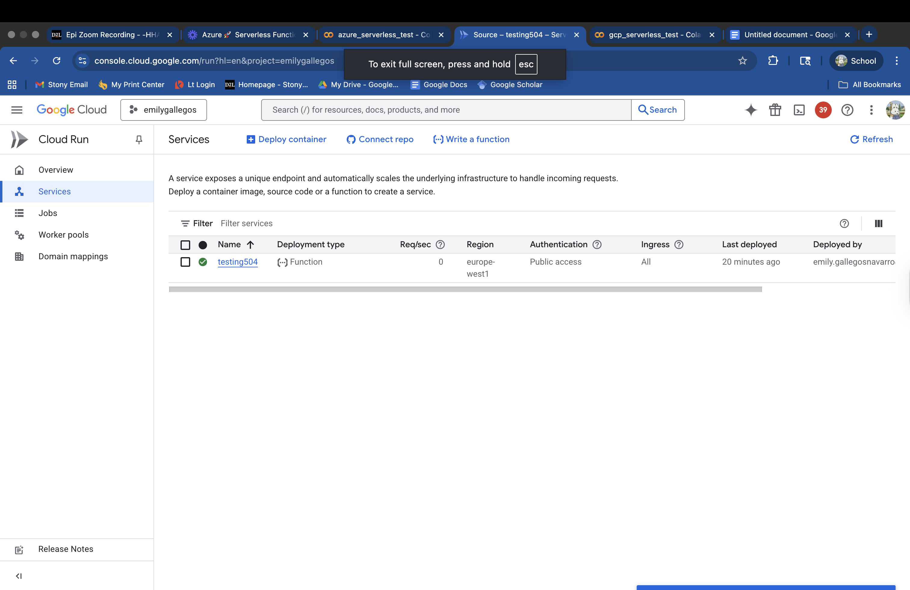
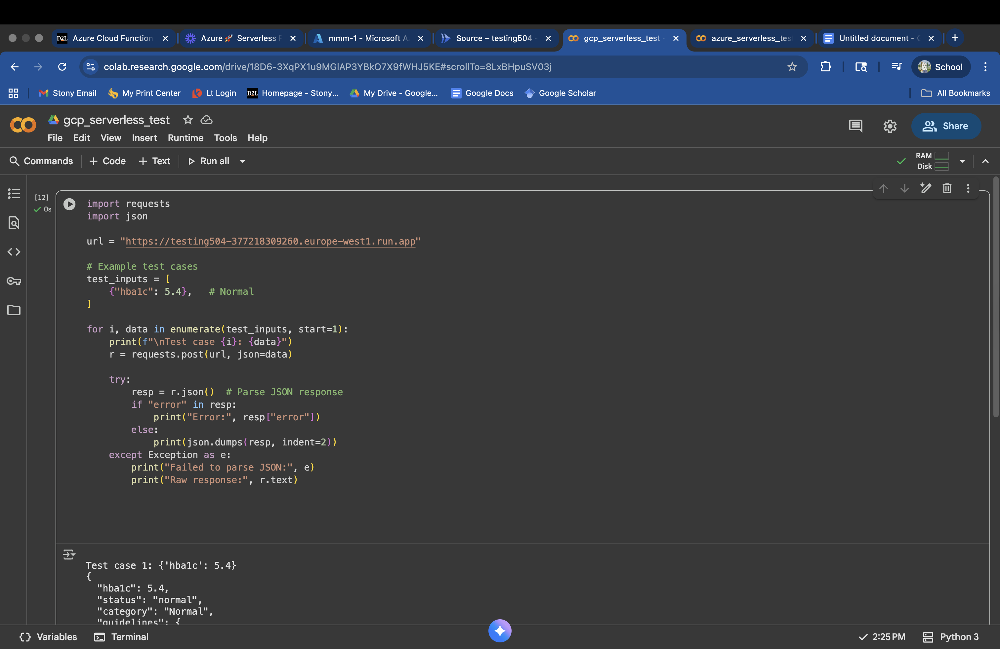
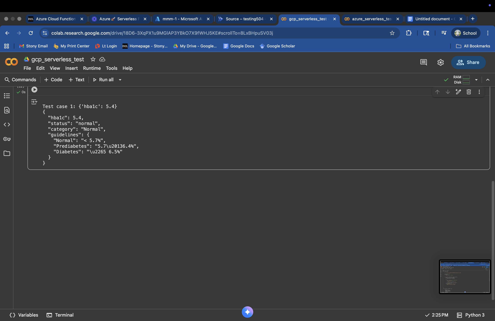

## GCP Cloud Run 
To run the cloud function in the Google cloud console I first went to the search bar and looked for "cloud run". This is where the serverless coud functions live. From there I created the serverless function and was able to edit the code. After having made changes to my code, I used the COLAB nootebook in order to run a GET request. In there I used a python script that included my serverless URL to connect the two and get a JSON output. 

## screenshots 
these screenshots show the gcp source code tab with my full python script 

GCP logs 

GCP running 

GCP to COLAB output 

