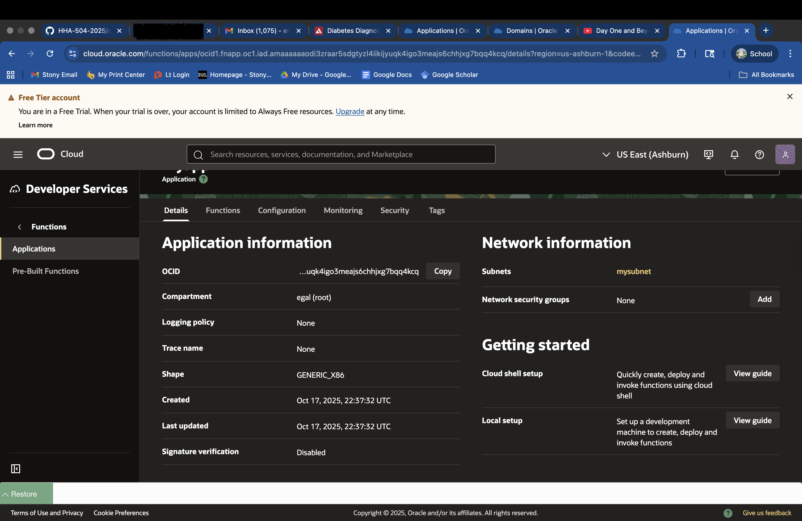
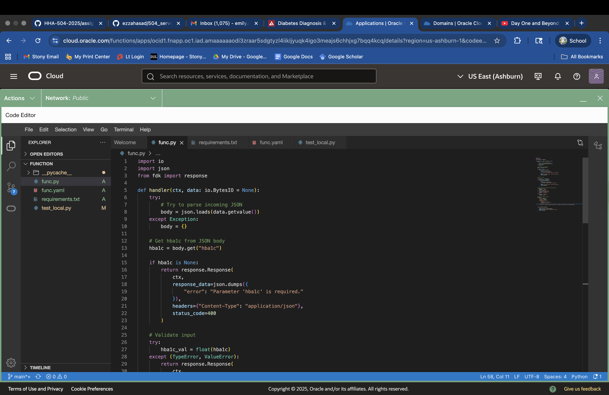
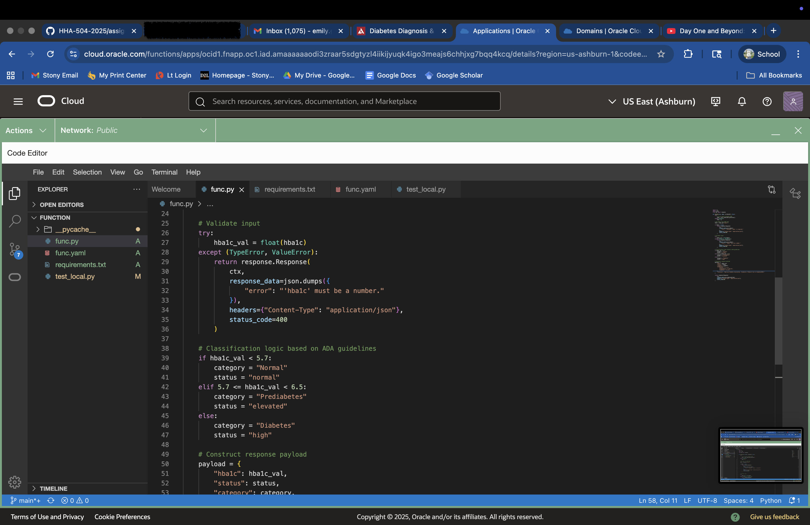
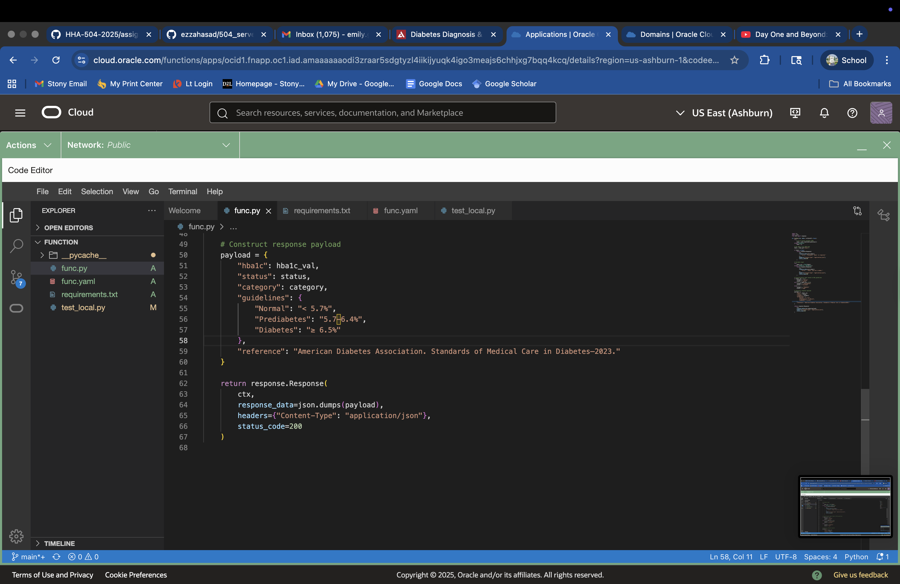
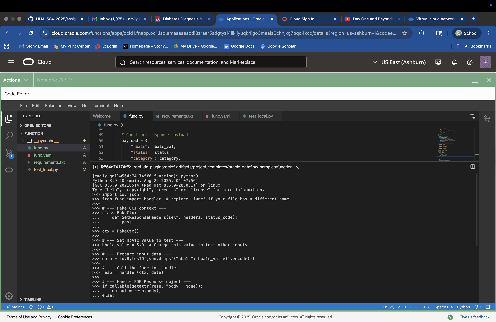
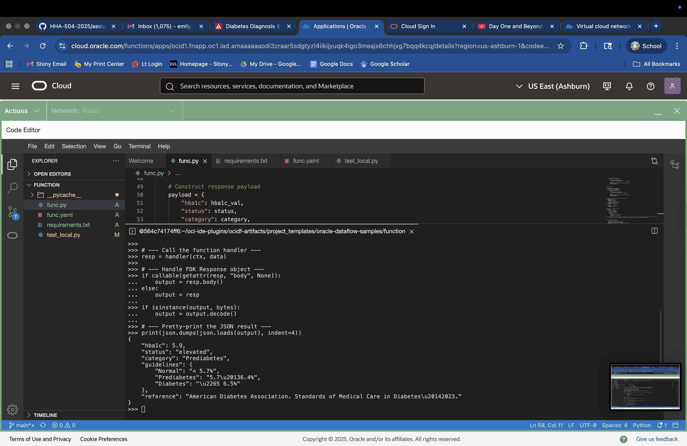
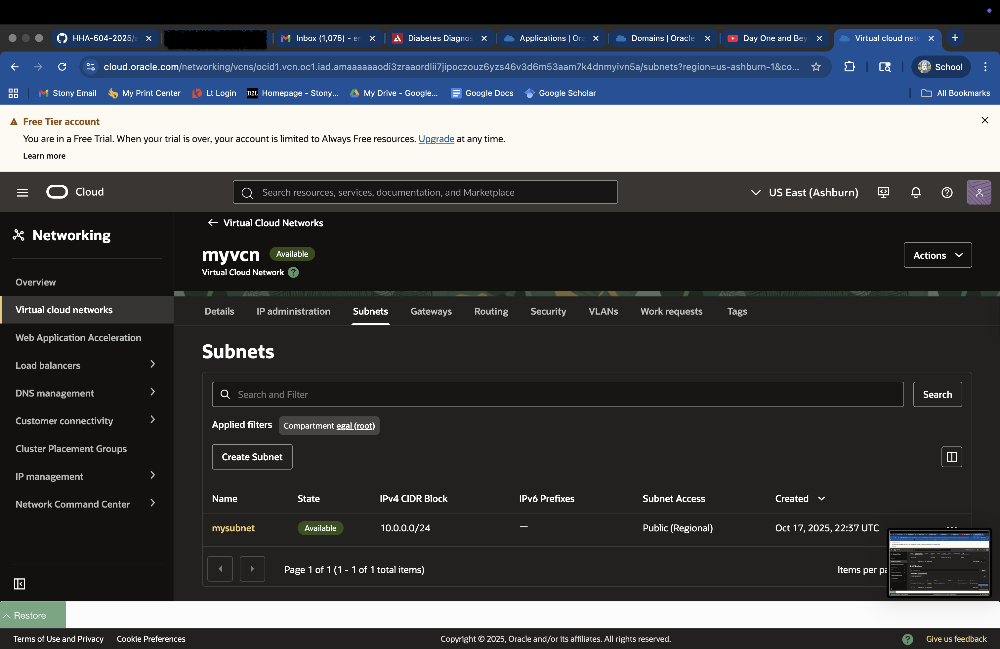
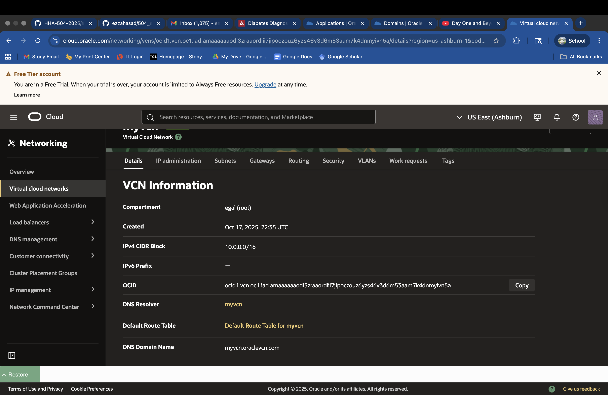

## OCI Cloud 
Before creating a function in OCI, first you have to create a VCN and a subnet. To create both of those I searched them up in the search bar to find them. To create the VCN it I hit crate vcn and only made changes to the VCN name and the IPv4 CIDR Blocks. After creating the vcn I clicked on the vcn and navigated to the 'subnets' category in order to create a subnet for this particular vcn. then to create the application in OCI I searched for it in the search bar and found the one that was under the "developer services". From there I selected create application and selected the vcn and subnets I had previously made. I left the shape as generic and then hit create. Once created I went ot functions and selected 'create in code editor' and from there it took me to a version of VSCode that lives within OCI. There is wehre i created my python script and ran only basic terminal commands since the function was undeployable. 

## screnshots 
OCI application information

OCI function file 

OCI view of the terminal 

OCI subnet and VCN details 

